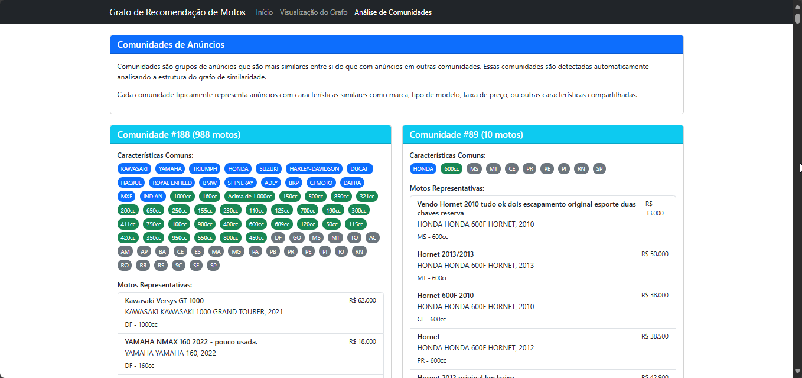
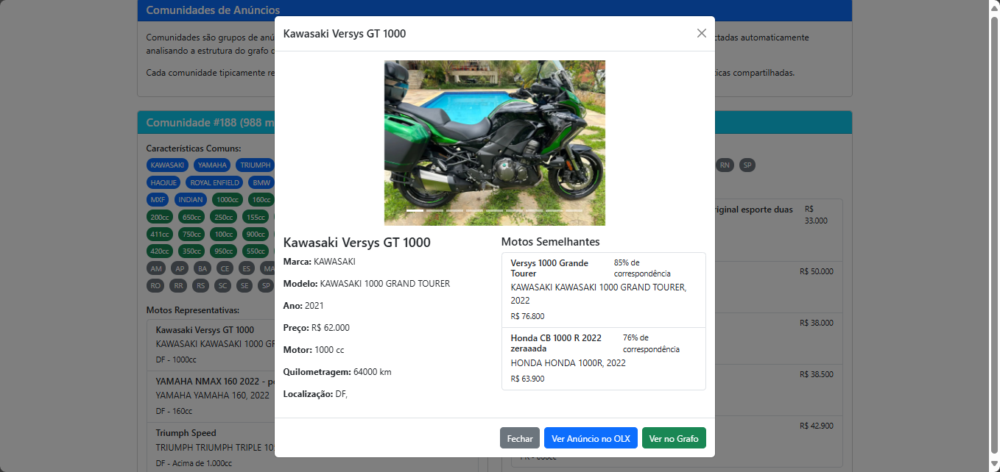
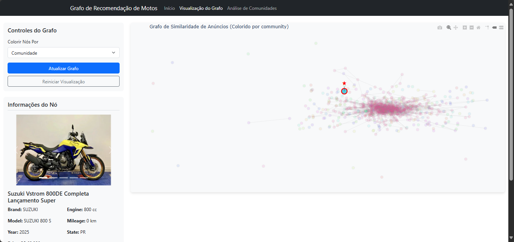

# **Grafos 1 - Recomendação de Motos em Anúncios da OLX** 


**Conteúdo da Disciplina**: Grafos 1

## Alunos

| Matrícula | Aluno                     |
| --------- | ------------------------- |
| 200056981 | Arthur Ferreira Rodrigues |
| 190084731 | Augusto Duraes Camargo    |

## Link para o Vídeo

[Vídeo no Youtube](https://youtu.be/8Ih6WNngBNc)

## Sobre

O projeto consiste em um web scraper que coleta dados de anúncios de motos da OLX e utiliza algoritmos de grafos para gerar recomendações personalizadas. O sistema cria um grafo onde os vértices são as motos anunciadas e as arestas representam similaridades entre elas (como faixa de preço, localização, marca etc). 

A similaridade entre anúncios é calculada usando uma combinação de características, como marca, modelo, ano, preço, cilindrada e localização. Quanto maior a similaridade entre dois anúncios, mais forte a aresta entre eles. O sistema utiliza algoritmos de detecção de comunidades para identificar grupos de motos similares e algoritmos de busca em grafos para encontrar as recomendações mais relevantes.

A aplicação web permite aos usuários:
- Visualizar o grafo de similaridade de forma interativa
- Explorar comunidades de anúncios similares
- Buscar motos específicas e ver recomendações personalizadas
- Filtrar anúncios por estado e marca
- Visualizar dados estatísticos sobre os anúncios

Algoritmos de grafos implementados:
- Cálculo de similaridade para ponderação de arestas
- Detecção de comunidades
- Busca por vizinhos mais próximos para recomendações
- Layout Kamada-Kawai para visualização do grafo

## Screenshots

### Página de Comunidades




### Página de Grafo Interativo


## Instalação 

**Linguagem**: Python 3.9+

**Frameworks e Bibliotecas**:
- Flask (servidor web)
- Plotly (visualização interativa)
- Scikit-learn (cálculo de similaridade)
- Pandas & NumPy (manipulação de dados)
- Matplotlib (visualizações estatísticas)

### Pré-requisitos

1. Python 3.9 ou superior
2. Pip (gerenciador de pacotes Python)

### Passos para instalação

1. Clone o repositório:

2. Instale as dependências:
   ```
   pip install -r requirements.txt
   ```

3. Os dados já estão incluídos no arquivo `motos_data.json`. Se quiser coletar novos dados, execute o script de scraping:
   ```
   python initial_populate.py
   ```

## Uso 

1. Inicie o servidor Flask:
   ```
   python app.py
   ```

2. Acesse a aplicação no navegador:
   ```
   http://localhost:5000
   ```

3. Navegação na aplicação:
   - **Visualização do Grafo**: Permite explorar o grafo de similaridade de forma interativa
   - **Análise de Comunidades**: Mostra grupos de anúncios similares agrupados em comunidades

4. Funcionalidades:
   - Clique em um anúncio para ver seus detalhes e motos similares
   - Utilize a barra de busca para encontrar motos específicas
   - Filtre os anúncios por estado ou marca
   - No grafo interativo, clique em nós para ver detalhes e conexões
   - Explore as comunidades para descobrir padrões nos anúncios

## Outros 

- O sistema utiliza cache para melhorar o desempenho das visualizações do grafo.
- A detecção de comunidades é feita utilizando o algoritmo de Louvain implementado no NetworkX.
- A similaridade entre anúncios é calculada considerando características como preço, marca, modelo, ano, e localização, com pesos atribuídos a cada característica.
- O layout do grafo é gerado usando o algoritmo Kamada-Kawai, que posiciona os nós de forma a manter os mais similares próximos uns aos outros.
- Os dados coletados são armazenados em formato JSON para facilitar o processamento e persistência.